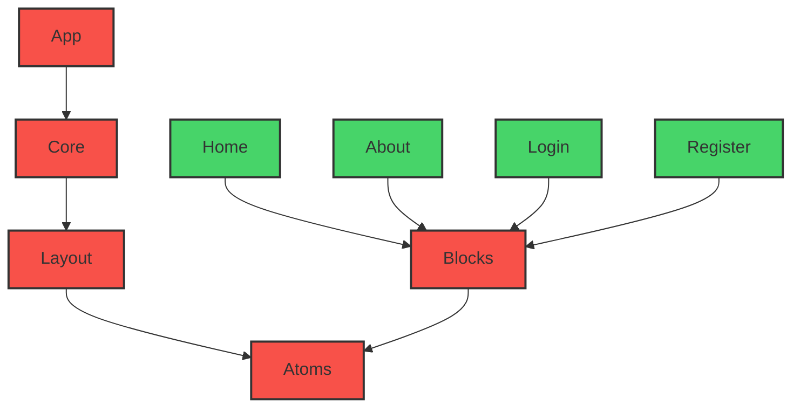
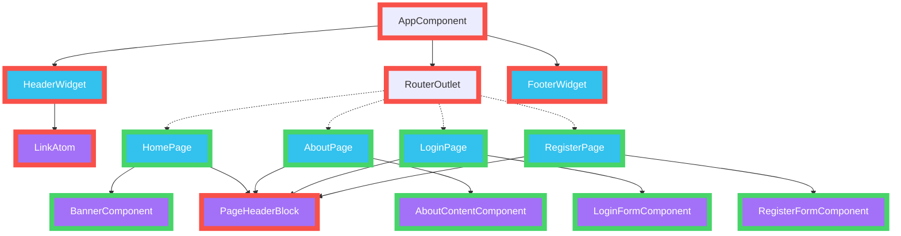

# Declarative tree

## Modules

```mermaid
graph TD
    App --> Core
    Core --> Layout
    Layout --> Atoms

    Home --> Blocks

    About --> Blocks

    Login --> Blocks

    Register --> Blocks

    Blocks --> Atoms

    %% Styling
    classDef eager fill:#f85149,stroke:#333,stroke-width:2px;
    class App,Core,Layout,Atoms,Blocks eager;
    classDef lazy fill:#47d469,stroke:#333,stroke-width:2px;
    class Home,About,Login,Register lazy;

```

## Components

```mermaid
graph TD
    AppComponent --> HeaderWidget
    HeaderWidget --> LinkAtom
    AppComponent --> RouterOutlet
    AppComponent --> FooterWidget

    RouterOutlet -.-> HomePage
    HomePage --> BannerComponent
    HomePage --> PageHeaderBlock

    RouterOutlet -.-> AboutPage
    AboutPage --> PageHeaderBlock
    AboutPage --> AboutContentComponent

    RouterOutlet -.-> LoginPage
    LoginPage --> PageHeaderBlock
    LoginPage --> LoginFormComponent

    RouterOutlet -.-> RegisterPage
    RegisterPage --> PageHeaderBlock
    RegisterPage --> RegisterFormComponent


    classDef smart fill:#33c1ee,stroke:#333,stroke-width:2px,color:#fff;
    class HomePage,AboutPage,LoginPage,RegisterPage,HeaderWidget,FooterWidget smart;
    classDef dumb fill:#a371f7,stroke:#333,stroke-width:2px,color:#fff;
    class LinkAtom,PageHeaderBlock,BannerComponent,AboutContentComponent,LoginFormComponent,RegisterFormComponent dumb;
    classDef eager stroke:#f85149,stroke-width:8px;
    class AppComponent,RouterOutlet,HeaderWidget,FooterWidget,LinkAtom,PageHeaderBlock eager;
    classDef lazy stroke:#47d469,stroke-width:8px;
    class HomePage,AboutPage,LoginPage,RegisterPage,BannerComponent,AboutContentComponent,LoginFormComponent,RegisterFormComponent lazy;


```
